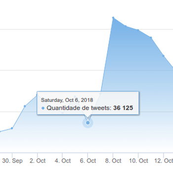
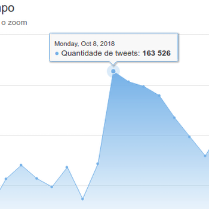

# Twitter Sentiment Analysis

### Análise de Sentimentos Utilizando o Twitter nas Eleições Brasileiras de 2018.

### Website: https://diegowendel.github.io/sentiment-analysis

Projeto realizado no ano de 2018, aplicando inteligência artificial para classificação de sentimentos presentes nos textos compartilhados em postagens do Twitter. Todas postagens com relação a algum dos candidatos presidenciáveis nas eleições brasileiras de 2018 foi coletada no período de 05/09/2018 até 28/10/2018.

O trabalho pode ser dividido em duas partes:
* **Coleta e contagem:** Coleta do maior número possível de tweets que mencionssem algum dos candidatos presidenciáveis e análise da quantidade total de menções recebidas de cada candidato.
* **Classificação:** Classificação de sentimentos presentes nos tweets, podendo ser classificado em positivo, negativo ou neutro. A classificação foi feita com inteligência artificial, utilizando a biblioteca [scikit-learn](https://scikit-learn.org/stable/) e um classificador do tipo *Support Vector Classifier* (SVC), baseando-se em técnicas de apredizado de máquina supervisionado.

---

## Contagem de Tweets

A contagem de postagens sobre os candidatos possibilitou analisar eventos únicos que promoveram alguma repercussão no Twitter. A seguir, são mostrados alguns picos (aumento repentino), no número de tweets relacionados aos candidatos.

### Pico no gráfico do candidato Jair Bolsonaro

No dia 6 de setembro de 2018, o candidato [Bolsonaro leva uma facada em atentado durante campanha em Juiz de Fora](https://veja.abril.com.br/politica/bolsonaro-leva-facada-em-atentado-durante-campanha-em-juiz-de-fora/). A repercussão desse acontecimento pode ser notada no salto da quantidade de tweets mencionando o candidato, de *39.105* no dia 5 para *166.110* no dia 6 de setembro.

Número de tweets Bolsonaro - 05 de setembro             |  Número de tweets Bolsonaro - 06 de setembro
:-------------------------:|:-------------------------:
  |  

### Pico no gráfico do candidato Guilherme Boulos

Debates entre os candidatos presidenciáveis geraram repercussões notáveis na popularidade dos candidatos no Twitter, como no caso de Guilherme Boulos, que teve um aumento de *5.789* tweets no dia 04 de outubro para *72.135* tweets no dia 05 de outubro. O debate que ocorreu nessa data foi o [debate promovido pela rede Globo](https://g1.globo.com/politica/eleicoes/2018/noticia/2018/10/05/veja-a-integra-do-debate-na-globo.ghtml), que teve início no fim da noite do dia 4 de outubro e finalizou na madrugada do dia 5 de outubro. Fato que solidifica os resultados obtidos e mostrados nas figuras. Os outros participantes do debate também tiveram picos em seus gráficos, mas o mais percetível obtido foi o de Boulos.

Número de tweets Boulos - 04 de outubro             |  Número de tweets Boulos - 05 de outubro
:-------------------------:|:-------------------------:
  |  

### Pico no gráfico do candidato Fernando Haddad

Nos gráficos de Fernando Haddad, mostrados logo abaixo, percebe-se que no dia 06 de outubro houveram *36.125* tweets mencionando o candidato e logo após, no dia 08 de outubro, essa marca chegou a *163.526* tweets. O evento nesse intervalo de datas que causou tal repercussão, foi o dia 7, dia do [primeiro turno das eleições](https://g1.globo.com/politica/eleicoes/2018/noticia/eleicoes-2018-datas.ghtml). Como Haddad concorreu ao segundo turno, após o dia 7 de outubro sua popularidade aumentou consideravelmente em comparação com os dias anteriores de campanha. Portanto, esse é o fato que explica o aumento repentino da popularidade do candidato nessa data.

Número de tweets Haddad - 06 de outubro             |  Número de tweets Haddad - 08 de outubro
:-------------------------:|:-------------------------:
  |  

### Visão geral da contagem

Em resumo, a tabela abaixo mostra os resultados da coleta e contagem de tweets relacionados a cada candidato que concorreu ao cargo presidencial em 2018 no Brasil. As linhas em **negrito** indicam que a coloção no ranking de *popularidade* foi a mesma que no ranking das votações oficiais (Exemplo: Bolsonaro foi o mais votado nas eleições e obteve mais tweets falando de sua pessoa). Isso pode ser notado nas linhas 1, 2, 3, 4, 12 e 13 da tabela.

<table>
    <thead>
        <th>Posição</th>
        <th>Candidato</th>
        <th>Votos</th>
        <th>Tweets</th>
    </thead>
    <tbody>
        <tr>
            <td><strong>1</strong></td>
            <td><strong>Jair Bolsonaro</strong></td>
            <td><strong>49.277.010</strong></td>
            <td><strong>5.417.003</strong></td>
        </tr>
        <tr>
            <td><strong>2</strong></td>
            <td><strong>Fernando Haddad</strong></td>
            <td><strong>31.342.051</strong></td>
            <td><strong>2.413.000</strong></td>
        </tr>
        <tr>
            <td><strong>3</strong></td>
            <td><strong>Ciro Gomes</strong></td>
            <td><strong>13.344.371</strong></td>
            <td><strong>1.800.999</strong></td>
        </tr>
        <tr>
            <td><strong>4</strong></td>
            <td><strong>Geraldo Alckmin</strong></td>
            <td><strong>5.096.350</strong></td>
            <td><strong>464.565</strong></td>
        </tr>
        <tr>
            <td>5</td>
            <td>João Amoêdo</td>
            <td>2.679.745</td>
            <td>342.847</td>
        </tr>
        <tr>
            <td>6</td>
            <td>Cabo Daciolo</td>
            <td>1.348.323</td>
            <td>296.029</td>
        </tr>
        <tr>
            <td>7</td>
            <td>Henrique Meirelles</td>
            <td>1.288.950</td>
            <td>92.049</td>
        </tr>
        <tr>
            <td>8</td>
            <td>Marina Silva</td>
            <td>1.069.578</td>
            <td>432.944</td>
        </tr>
        <tr>
            <td>9</td>
            <td>Álvaro Dias</td>
            <td>859.601</td>
            <td>76.571</td>
        </tr>
        <tr>
            <td>10</td>
            <td>Guilherme Boulos</td>
            <td>617.122</td>
            <td>348.192</td>
        </tr>
        <tr>
            <td>11</td>
            <td>Vera Lúcia</td>
            <td>55.762</td>
            <td>94.225</td>
        </tr>
        <tr>
            <td><strong>12</strong></td>
            <td><strong>José Maria Eymael</strong></td>
            <td><strong>41.710</strong></td>
            <td><strong>12.069</strong></td>
        </tr>
        <tr>
            <td><strong>13</strong></td>
            <td><strong>João Goulart</strong></td>
            <td><strong>30.176</strong></td>
            <td><strong>9.306</strong></td>
        </tr>
    </tbody>
</table>

---

## Classificação de Tweets

Classificar os tweets em positivo, negativo ou neutro possibilitou analisar de maneira mais apurada se a popularidade dos candidatos, verificada na etapa anterior, era boa ou ruim. Também foi possível comparar os resultados individuais de cada um e assim descobrir o candidato *mais querido*.

As classificações foram feitas com aprendizado de máquina supervisionado. Portanto, foi necessário decidir um tipo de classificador para ser empregado, então foi feita uma bateria de testes com diversos tipos de classificadores e ao fim dos testes foi decidido utilizar o [SVC](https://scikit-learn.org/stable/modules/generated/sklearn.svm.SVC.html), que se mostrou o mais exato para o conjunto de dados obtido.

As classificações individuais podem ser conferidas na [aplicação web](https://diegowendel.github.io/sentiment-analysis/classificacoes) do projeto, mas aqui são exibidas as classificações dos tweets dos candidatos que concorreram até o segundo turno das eleições. Abaixo, seguem as classificações de Bolsonaro e Haddad respectivamente:

Classificação dos tweets relacionados ao candidato Jair Bolsonaro.

  

Classificação dos tweets relacionados ao candidato Fernando Haddad.

  

Analisando os gráficos, fica claro que após o dia 7 de outubro (dia do 1º turno), Fernando Haddad teve um aumento considerável no volume de tweets de todas as classificações, mas majoritariamente neutra. Já no caso de Bolsonaro, ele teve uma média de tweets positivos maior que negativos durante o período de campanha, mas após o dia do 1º turno, houve um aumento nas classes de tweets negativos e neutros a seu respeito.

### Visão geral da classificação

A tabela de classificações dos tweets dos candidatos possibilita verificar quais os candidatos *mais* e *menos* queridos das eleições. João Amoêdo obteve a maior média de tweets positivos (44,9%) sendo assim o *mais querido*, já Geraldo Alckmin com a maior média negativa (31,7%), foi o *menos querido* das eleições.

<table>
    <thead>
        <th>Posição</th>
        <th>Candidato</th>
        <th>Tweets</th>
        <th>% positivo</th>
        <th>% negativo</th>
        <th>% neutro</th>
    </thead>
    <tbody>
        <tr>
          <td>1</td>
          <td>Jair Bolsonaro</td>
          <td>1.206.870</td>
          <td>36,2</td>
          <td>22,8</td>
          <td>41</td>
        </tr>
        <tr>
          <td>2</td>
          <td>Fernando Haddad</td>
          <td>708.120</td>
          <td>26,1</td>
          <td>31,2</td>
          <td>42,7</td>
        </tr>
        <tr>
          <td>3</td>
          <td>Ciro Gomes</td>
          <td>290.344</td>
          <td>44,8</td>
          <td>20</td>
          <td>35,2</td>
        </tr>
        <tr>
          <td>4</td>
          <td>Geraldo Alckmin</td>
          <td>232.463</td>
          <td>28,5</td>
          <td>31,7</td>
          <td>39,8</td>
        </tr>
        <tr>
          <td>5</td>
          <td>João Amoêdo</td>
          <td>202.347</td>
          <td>44,9</td>
          <td>18,6</td>
          <td>36,5</td>
        </tr>
        <tr>
          <td>6</td>
          <td>Guilherme Boulos</td>
          <td>151.666</td>
          <td>30,8</td>
          <td>27,7</td>
          <td>41,5</td>
        </tr>
        <tr>
          <td>7</td>
          <td>Marina Silva</td>
          <td>96.723</td>
          <td>42,3</td>
          <td>19,4</td>
          <td>38,3</td>
        </tr>
        <tr>
          <td>8</td>
          <td>Álvaro Dias</td>
          <td>38.028</td>
          <td>32,2</td>
          <td>28,4</td>
          <td>39,4</td>
        </tr>
        <tr>
          <td>9</td>
          <td>Cabo Daciolo</td>
          <td>34.857</td>
          <td>37</td>
          <td>17,2</td>
          <td>45,8</td>
        </tr>
        <tr>
          <td>10</td>
          <td>Henrique Meirelles</td>
          <td>12.762</td>
          <td>38,2</td>
          <td>20,9</td>
          <td>40,9</td>
        </tr>
        <tr>
          <td>11</td>
          <td>José Maria Eymael</td>
          <td>917</td>
          <td>41,9</td>
          <td>14,9</td>
          <td>43,2</td>
        </tr>
        <tr>
          <td>12</td>
          <td>João Goulart</td>
          <td>705</td>
          <td>38,3</td>
          <td>20,3</td>
          <td>41,4</td>
        </tr>
        <tr>
          <td>13</td>
          <td>Vera Lúcia</td>
          <td>623</td>
          <td>33,5</td>
          <td>24,1</td>
          <td>42,4</td>
        </tr>
    </tbody>
</table>

Quanto ao resultado final das eleições, se forem combinados os resultados da coleta de tweets com as classificações dos mesmos, fica claro que dentre os candidatos que concorreram ao segundo turno **Jair Bolsonaro** venceria. Bolsonaro foi mais popular na contagem dos tweets com *5.417.003* menções de usuários em postagens contra *2.413.000* de Haddad. Além disso, Bolsonaro obteve uma maior média de tweets positivos (36,2%) do que Haddad (26,1%), e menor média de tweets negativos, 22,8% contra 31,2%.

Os dados foram coletados antes e durante o período de eleições, entretanto, as análises foram feitas após os resultados finais da eleições. Logo, não houve nenhum intuito de predizer nenhum tipo de resultado e sim analisar a eficácia da análise de sentimentos em textos de redes sociais, que se mostrou um tópico valioso e com muito potencial de desenvolvimento para o futuro.
